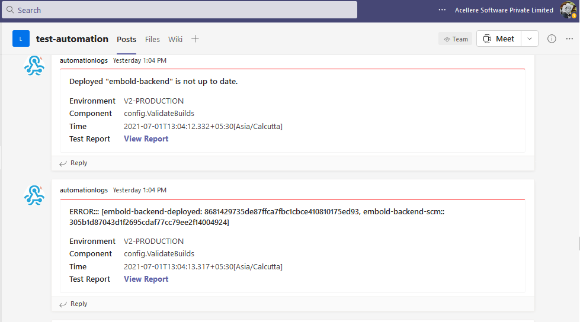

# Embold Test Automation

Automated validation for V2 UI and API Tests

## Features

- Pre-configured Maven based Java project.
- **Currently** powered by Selenium WebDriver and TestNG.
- Run from Terminal / IDE / Jenkins
- Test Reporting using Allure Jenkins plugin and Allure Service Docker

> Please note, this project is currently configured to run on Google Chrome, Mozilla Firefox and Microsoft Edge. Rest browsers are not supported yet.

## Project Configuration

### **Prerequisites**

Following configuration is needed in order to run this project locally.

- [Apache Maven] 3.5+ (https://maven.apache.org/)
- [JRE] 8u171+(https://8u171.oracle.com/java/technologies/javase/javase8-archive-downloads.html)
- [Allure](https://docs.qameta.io/allure/#_installing_a_commandline)

> After installing above, make sure you have three environment variables set in your local machine - `${JAVA_HOME}`, `${M2_HOME}`, `${ALLURE_HOME}`


After setting up environment variables, clone this repository

```sh
git clone https://github.com/acellere/gammatestautomation
```

## Project Execution

Run maven goal. You can configure maven goal by providing some custom `${env}` variables. You can provide browser and
platform on which tests needs to be run. You can give your localhost URL too. For example,

```sh
mvn test -Dbrowser=firefox -DappUrl=http://localhost:4333/auth/
```

or run on cloud platform

```sh
mvn test -Dbranch="sprints/21.4.0" -DappUrl=https://v2.emboldct.dev/
```

Please note, execution will fail if Google Chrome or the browser you selected for execution is not installed on your
local machine.

### Supported Environment Variables

| Environment Variable | Supported Value | Default Value |
| ------ | ------ | ------ |
| browser |chrome, edge, firefox | chrome |
| appUrl | Embold URL | https://app.gamma-staging.com |
| branch | Repository branch | NA |
| ghuser | Provide GitHub Username | ${local_env} |
| ghpass | Provide GitHub Password | ${local_env} |
| bbuser | Provide Bitbucket Username | ${local_env} |
| bbpass | Provide Bitbucket Password | ${local_env} |
| teamsWebhook | Provide Your MS Teams Webhook | ${local_env} |

- Default branch is not set. If you don't provide branch, build verification will be skipped.
- You can set your GitHub and Bitbucket account credentials as env vars in your local system with same keys. This is not
  mandatory.
- **${local_env}** in above table will read from set environment variables. If env vars not set, then it is mandatory to
  provide as below
    ```sh
    mvn test -Dghuser=myuser -Dghpass=mypass
    ```
- When you run mvn goal without providing any custom `${env}` by simply executing

  `mvn test` execution will be carried out with default values set. Here **Google Chrome** and Default Profile set in
  pom.xml.
- You can run maven goal directly by specifying environment. Project is configured to run for 4 environments.
    1. Development Instance (Drone)
    1. Embold V2 Staging
    3. Embold V2 Bluegreen
    4. Embold V2 Production

  For example,
  > > `mvn test -Pdrone -Dbranch="sprints/21.4.0"`
  >
  >> `mvn test -Pstaging -Dbbuser=myuser -Dbbpass=mypass`
  >
  >> `mvn test -Pbg`
  >
  >> `mvn test -Pprod -Dbrowser=firefox`

  Execution will continue with set and provided details.
- Microsoft Teams Webhook is necessary for Teams Logging in public channels. You can opt for not specifying webhook. You
  can run similar goar like below to see runtime notification for automation suite under execution.
  ```shell
  > mvn test -Pstaging -DteamsWebhook="YOUR_WEBHOOK_URL"
  ```
  You can see output like below:

  

- However, in order for webhook to work, you need to set it as environment variable in your local system with
  key `teamsWebhook`

  or simply specify it in maven goal
  `-DteamsWebhook`while executing.

## Test Report Generation

Test report generation is carried out by using Allure framework. After successful / unsuccessful execution,
**allure-results** directory gets created at root location (where pom.xml is located). Simply run below command at
project's root location

```sh
allure serve allure-results
```

Whenever new changes are integrated, you can run above command with your required `${env}` values and see the latest
report right after execution.

> Note: Allure report is not static report and hence cannot be downloaded. Refer [this issue](https://github.com/allure-framework/allure2/issues/755)

-------------------------------------- 
Jenkins Report
--------------------------------------

In order to run the tests remotely on Jenkins, you can refer below job.
> http://192.168.2.24:8080/job/emboldv2/job/uibots/

- Build this Job with required parameters. In case no values provided, tests will run with default configuration as
  mentioned earlier.
- Allure Report is generated on same Jenkins instance. You can view it in same workspace.
- Jenkins is not configured currently to run this job on localhost

-------------------------------------- 
Allure Docker Service Report
--------------------------------------

Allure Docker Service is configured with this project. You can access sample report here:
> http://192.168.2.24:7744/embold/v2/test-automation/signin

- This is sample report. You can use below credentials to view report.
- **Username:** redstar **Password:** redstar

## Development

Want to contribute? Great!
Clone this repository and ask for collaboration access to owner.